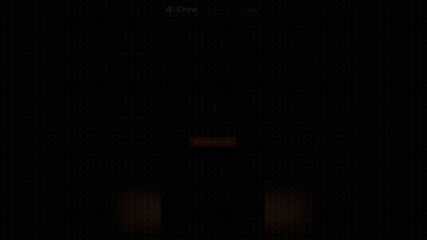

# AllCrew Figma Workspace

**A local-first Figma development plugin and MCP workspace for Claude Code, Codex, Cursor, design tokens, project export, and controlled agent writes.**

[](https://github.com/mal4i6ka/allcrew-figma-plugin/releases/latest)
[](https://github.com/mal4i6ka/allcrew-figma-plugin/actions/workflows/ci.yml)
[](LICENSE)

[**Download the latest release**](https://github.com/mal4i6ka/allcrew-figma-plugin/releases/latest) · [Install](#install-from-a-github-release) · [Security model](SECURITY.md) · [Report an issue](https://github.com/mal4i6ka/allcrew-figma-plugin/issues/new/choose)

<p align="center">
  <a href="docs/demo/allcrew-figma-workspace-demo.mp4"></a>
</p>

## Why

Design handoff is more than pixels. Agents need the variables behind values, component behavior, prototype edges, assets, and the live state of the file a designer has open. AllCrew exposes that context through a user-run loopback bridge, then keeps reads and writes behind separate switches visible in Figma.

It also exports usable deliverables: mode-aware tokens, React, Django, Tauri, native color resources, documentation, and declarative custom plugin screens.

Core extraction and generation run inside Figma. Optional Delivery and Agent Listener connections go only to endpoints the user configures; AllCrew operates no hosted relay and collects no telemetry.

## AllCrew vs. the official Figma MCP server

The tools overlap, but they optimize for different workflows. Figma recommends its remote MCP server for broad official access. AllCrew is a development-plugin workspace for explicit, open-file automation and repository artifacts.

| Capability | Official Figma MCP | AllCrew Figma Workspace |
|---|---|---|
| Structured components, variables, layout context | Yes | Yes |
| Generate code from selected frames | Yes | Yes, plus packaged project exports |
| Write native Figma content | Remote MCP beta | Open plugin session with **Allow writes** |
| Open-file, observable operation log | Not the primary model | Yes |
| Design-token / Django / React / Tauri packages | Not its focus | Yes |
| Custom declarative plugin screens | No | Yes, through AllCrew SDK modules |
| Hosted service required | Remote is preferred; desktop also exists | No AllCrew service; loopback bridge |
| Distribution | Official remote/desktop MCP | GitHub development-plugin release |

Official capability references: [Figma MCP guide](https://help.figma.com/hc/en-us/articles/32132100833559) and [Codex setup](https://help.figma.com/hc/en-us/articles/39888629089175-Codex-and-Figma-Set-up-the-MCP-server).

## Install from a GitHub Release

1. Download `allcrew-figma-workspace-v<version>.zip` and `SHA256SUMS` from the
   [latest release](https://github.com/mal4i6ka/allcrew-figma-plugin/releases/latest).
2. Verify the archive:
   ```bash
   shasum -a 256 -c SHA256SUMS
   ```
3. Unzip it without flattening the directory structure.
4. In Figma Desktop, open **Menu → Plugins → Development → Import plugin from manifest…**.
5. Select `manifest.json` in the extracted folder.
6. Run **AllCrew Figma Workspace** from **Plugins → Development**.

Figma's browser app cannot import development plugins. Updating means downloading the new
release, replacing the extracted directory, and restarting the plugin.

### Build and install from source

```bash
npm ci
npm run build
```

Import this checkout's `manifest.json`. `npm run dev` rebuilds on change; `npm run package`
creates the release archive and refuses to package stale bundles.

## Use

1. Open the Figma file that holds your design-system variables & collections.
2. Run the plugin. It scans automatically and shows a summary:
   collections, modes (themes) and variable counts.
3. Click **⚙Settings** (top-right) to open the settings page and tune the
   output (see below). Choices persist per-user via `figma.clientStorage` and
   re-apply on every run.
4. **Download package (.zip)** — or grab any single file. **Rescan** after you
   edit variables.

### Resizable panel

Drag the bottom-right corner to resize the plugin between 340×320 and 1240×1200 pixels.
Double-click the handle to fit the current page's height without changing its width. The size is
stored per machine in `figma.clientStorage` and restored on the next run. Every native view
consumes the available width; at narrow sizes the header, settings controls, palette editor,
module actions, tables and footer collapse or scroll without clipping. At 560 pixels wide the
palette editor gains a third field column. At 720 pixels the export, token, DS Tools and Agent
Listener screens switch to semantic split grids. Django and Tauri keep setup and review work in
independent vertical lanes, so a tall linter cannot push a wide regeneration card below an empty
grid row. Dense palette, remap and video workflows retain wider spans, while declarative module
blocks use an auto-fit grid. Heterogeneous screens avoid row-spanning cards, so tall skill/code
content cannot create a hole beneath a shorter sibling.
The internal workspace stops growing at 1200 pixels, Agent skill content is capped at 520 pixels,
and lone DS generator cards stop at 560 pixels in split layouts. Resize drag accumulates consecutive screen-space
deltas in floating-point dimensions, clamps that accumulator without overshoot, and rounds only
the size sent to Figma. Reversing direction therefore moves the edge immediately on mouse and
trackpad input. Live requests are coalesced per frame and only the final size is persisted.
The live browser mirror follows its browser window and hides the Figma-only resize handle.

## Agent Listener quick start

The release archive includes the exact bridge and MCP front built with the plugin:

```bash
node tools/bridge.mjs
```

Open **Agent Listener** in the plugin, pair during the five-minute window, then enable **Allow
reads**. Enable **Allow writes** only while an intended automation is running. For an MCP client:

```bash
node tools/mcp.mjs --install claude
# cursor, windsurf and vscode are also supported
```

Development-plugin grants are session-only. Restarting the plugin closes both gates.

## What you get

| File | Contents |
|------|----------|
| `tokens.css` | CSS custom properties. **One self-contained block per theme.** The merged single file. |
| `<theme>.module.css` | The same blocks split **one CSS Module per theme** (`light.module.css`, `dark.module.css`, …), wrapped in `:global(…)`. Merged by your bundler (which strips `:global`), they're equivalent to `tokens.css`. |
| `tokens.json` | Canonical W3C token tree — every mode under `$extensions.modes`, source collection under `$extensions.figma`. For diffing / re-import. |
| `tokens.ts` | Typed `tokens` object (values are `var(--…)` refs) + a `themes` list and `Theme` type. |
| `Assets.xcassets/<token>.colorset/Contents.json` | *(iOS & Android tokens on)* One colorset per colour, in sRGB components, with a `luminosity: dark` entry **only where the dark theme actually changes it** — so `Color("text-primary")` follows the system appearance with nothing in the app deciding. |
| `res/values/colors.xml`, `res/values-night/colors.xml` | *(iOS & Android tokens on)* The same, by Android resource qualifier. The night file is an override list: it carries only the colours that differ. |
| `Tokens.swift`, `Tokens.kt` | *(iOS & Android tokens on)* Constants for what a catalogue cannot hold (spacing, radii, the type scale) and for the colours too, for a build that themes in code. Values identical in every theme are declared once, above the per-theme blocks; a length gets `CGFloat`/`.dp`, a line-height ratio does not. |
| `README.md` | Auto-generated usage notes for that specific export. |

## Settings

The **Export Settings** page (open it from the gear in the header) isolates the
opinionated parts of the output so different consumers can keep their own
preferences (the choices persist per-user):

| Setting | Default | What it does |
|---------|---------|--------------|
| **Inline primitives** | on | Resolves aliases that point at a *primitive* (raw, single-mode value) into the literal, and drops the primitive layer. Aliases **between semantic tokens** stay as `var(--…)`. |
| **Flatten all aliases** | off | With Inline primitives on, also resolves the *semantic→semantic* `var(--…)` refs into literals, so **no** references remain in the output. Off keeps the readable, themeable semantic layer. |
| **Theme attribute** | `data-theme-name` | The attribute the theme blocks key off (`[<attr>="Dark"]`). Set it to `data-theme` to match the AllCrew Figma Workspace board, or anything else. |
| **Theme collections table** | empty | Maps any number of free-plan single-mode collections into exported multi-theme structures. Each row names the output structure, source collection and exported theme; repeat a structure name for Light, Dark, High contrast or additional brand themes. Conventional `theme` + `theme-dark` and `theme-light` + `theme-dark` layouts are detected automatically. |
| **Per-theme `.module.css`** | on | Whether to emit the per-theme module files alongside `tokens.css`. |
| **CSS Modules `:global()`** | on | Wrap module-file selectors in `:global(…)` (valid CSS Modules) or leave them plain. |
| **iOS & Android tokens** | off | Also emit the asset catalogue, `res/values{,-night}/colors.xml`, `Tokens.swift` and `Tokens.kt`. Off by default because a palette becomes one colorset *directory* per colour, which is noise in a package a web project unzips. |
| **Include library variables** | off | Read the variables of every enabled **library**, not just the local ones. It is a network read per token — 44 s on a file with 213 of them — and the only way to export a theme this file *consumes* rather than owns. Left off, the export's summary names the library collections it skipped, so a package with no theme in it says so instead of looking complete. |
| **Automatic update discovery** | off | Checks the latest GitHub Release at most once every 24 hours. A manual **Check now** action is always available. When a newer version exists, the plugin shows a quiet header banner with release and direct-download actions. |

### tokens.css shape

Every **mode** becomes one self-contained block declaring **all** variables for
that theme. The default theme also occupies `:root`, so an un-themed page still
renders.

With **Inline primitives** on (the default), the raw scale is collapsed into the
tokens that use it — no primitive variables in the output:

```css
:root,
[data-theme-name="Light"] {
  /* Tokens */
  --colors-action-default: #002780;
  --spacing-md: 8px;
}

/* add a "Dark" mode to the collection in Figma → a second full block appears */
[data-theme-name="Dark"] {
  /* …all variables again, dark values… */
}
```

Turn it **off** to keep the primitive layer and reference it via aliases instead
(byte-identical to the AllCrew Figma Workspace board, modulo the attribute name):

```css
:root,
[data-theme-name="Light"] {
  /* Primitives */
  --colors-b-800: #002780;
  --sizes-1: 8px;
  /* Tokens */
  --colors-action-default: var(--colors-b-800);
  --spacing-md: var(--sizes-1);
}
```

> A primitive used **directly in code** (not via an alias) can't be detected by the
> plugin — it will be inlined away. Turn Inline primitives off if you rely on the
> raw scale at call sites.

Switch theme by setting the attribute on any ancestor:

```html
<html data-theme-name="Dark">
```

### Per-theme `<theme>.module.css`

The same theme blocks are also emitted one file per theme, named after the mode
(`light.module.css`, `dark.module.css`, … — slugified), wrapped in `:global(…)`
so they're valid in a CSS-Modules project (Next.js, etc.):

```css
/* light.module.css */
:global(:root),
:global([data-theme-name="Light"]) {
  --colors-action-default: var(--colors-b-800);
  --spacing-md: var(--sizes-1);
}
```

The default theme also lands on `:global(:root)`. Concatenating every
`*.module.css` (or letting your bundler merge the ones you import) reproduces
`tokens.css` — that's the "merged single file". For **runtime** theme-switching,
keep every theme present (use `tokens.css`, or import all `*.module.css`) and
toggle `data-theme-name`.

## Django app export

With the **Django × Bootstrap** preset the package is not a folder of templates
waiting for someone to write a URLconf — it is a site you can run:

```bash
unzip export.zip -d site && cd site
pip install -r requirements.txt
DJANGO_DEBUG=1 python manage.py runserver
```

| What ships | Where it comes from |
|---|---|
| `manage.py`, `config/{settings,urls,wsgi,asgi}.py`, `design/{views,urls,pages,context_processors}.py` | Settings → Target → **Django project** (off when you apply onto a project that already has its own) |
| `templates/base.html` + one template per frame + one partial per component | the frames in scope; a component **set** becomes one partial, its variants CSS modifiers |
| `static/css/project.css`, `tokens.css`, `interactions.css`, `transitions.css` | layout/paint, design tokens, reaction states, prototype page transitions |
| `locale/figma.po` + `locale/<code>/LC_MESSAGES/django.po` | Settings → i18n → **Target languages** |

`design/pages.py` is the generated page registry — the one file a re-export
overwrites. Everything else reads it: the prototype's start frame serves at `/`,
every other page at `/<slug>/`, and the `navMap` context processor reverses those
routes so the `{{ navMap.nav_… }}` hrefs the markup already emits resolve (and pick
up the active locale prefix). Configure **Target languages** and the routes move
under `i18n_patterns` with a no-JS language switcher in the shell.

**Markup.** A frame named `Header`/`Nav`/`Footer`/`Sidebar` becomes that element, a page root's
other direct children become `<section>`, a text layer whose name states a level (`Heading 2`,
`Title/H3`) becomes `<h2>`/`<h3>` — with exactly one `<h1>` per page — and a layer that only reacts
to a click becomes a real `<button type="button">` instead of a div no keyboard can reach. Figma's
own auto-names (`Rectangle 12`, `Vector`) render as `alt=""`/`aria-hidden`, because a screen reader
announcing "Rectangle 12" is worse than silence. A layer the designer pinned with *Fixed position
when scrolling* gets `position: fixed`/`sticky` — that choice used to be read and then dropped.

What the CSS pass could only approximate or could not draw at all (squircle corners, NOISE /
TEXTURE / GLASS / SHADER effects and fills) is listed per node in `export-report.json` under
`fidelityNotes`, instead of disappearing into a console.

**Motion.** Reaction states (`ON_HOVER`/`ON_PRESS`/`ON_CLICK` → CHANGE_TO) are
diffed against the destination variant *including its descendants*, so a hover that
recolours an icon, re-pads a button or reveals a badge survives. Overlays render the
destination frame's own markup into a `<dialog>` with an open/close animation.
Page-to-page prototype transitions (DISSOLVE / PUSH / MOVE / SLIDE / SMART_ANIMATE)
become cross-document view transitions — Smart Animate assigns a shared
`view-transition-name` to the layers matched across both screens. Everything is
wrapped in `prefers-reduced-motion` guards.

The Smart Animate diff behind those states covers what Figma covers: position, size, rotation,
opacity, corner radii, strokes, the whole fill stack (gradients included, marked non-interpolable
where CSS cannot tween them), shadows and blurs, text size/weight/spacing/colour, auto-layout
padding and gap, visibility (with `transition-behavior: allow-discrete`) and blend mode — on the
changed layer itself as well as its descendants. A state that swaps a **photo** ships the
destination variant's image with the page assets and references it; when that image cannot be
exported the declaration is dropped rather than emitted as the `url(<path-to-image>)` placeholder
Figma hands out, which resolves to a 404 and blanks the element on hover.

**Springs.** A `CUSTOM_SPRING` reaction is solved from its own physics (`ω₀ = √(k/m)`,
`ζ = c / 2√(km)`, plus the designer's `initialVelocity`), and a named preset (`GENTLE`, `BOUNCY`, …)
from its bounce at the frequency whose period is the duration typed next to it. The emitted
`linear()` curve runs for the spring's real settle time, so a 150 ms bouncy press is a 150 ms-ish
bounce rather than the same half-second curve every spring used to collapse into.

Figma publishes no physics for its named presets, so those bounces come from a reverse-engineered
table — the one estimate left in the emitted motion, and `export-report.json` says so:
`estimatedSpringPresets` counts the curves that rest on it, and `springPresetCalibration` reports
what the file's own springs say the table should hold whenever Figma does supply the numbers. A
preset that arrives with real parameters is solved from them and never touches the table at all.

**Adaptivity.** Frames named `Home / desktop` + `Home / mobile` collapse into one
page: the widest frame is the DOM, the narrower ones become `@media` blocks, and
nodes that exist *only* in a narrow frame (the burger, a stacked CTA) are spliced in
hidden and revealed at their breakpoint. `base.html` carries the viewport meta, so
those queries apply on a real phone.

## React export & Code Connect

The React target writes a component per Figma component set, and beside each one a
`<Component>.figma.tsx` — the Code Connect mapping that tells Figma *this* is the code for that
design component. From then on Dev Mode and Figma's official MCP answer with
`<Button type="Primary" …>` and a real import, instead of anonymous markup a developer has to
recognise. A root `figma.config.json` ships with them, so the repository is publishable as it
lands:

```bash
npx figma connect publish --token <token>
```

Props are not guessed: the same variant/text/boolean definitions the component's own union types
come from become `figma.enum` / `figma.string` / `figma.boolean`, with the Figma property names
verbatim — `Button-lable` and `Meduim` are mapped as spelled, because that is what the file
contains. A component with no properties still gets a file with an empty `props`.

Two things worth knowing before troubleshooting a publish:

- **The library does not have to be published.** A mapping addresses its component by node URL
  (`?node-id=819-95512` — a dash, not the colon Figma stores), so `publishStatus: UNPUBLISHED`
  publishes fine. Publishing only matters for the MCP route, where `add_code_connect_map` refuses
  with "Published component not found".
- **The token must be the right category.** `file_code_connect:write` is not among the scopes a
  personal access token can carry — a PAT answers `403 Invalid scope(s)`, and a plan token of the
  REST API category has those endpoints switched off. It takes a plan access token of the
  **Figma CLI** category (figma.com/developers/tokens → Figma CLI tab; organization admin, 2FA).

`figma.fileKey` is granted only to a private plugin on an Organization plan. Without it a node URL
cannot be built, so no mapping files are written at all and the export report names that as the
reason — a half-written mapping pointing at a placeholder key would be worse than none.

## Automated delivery

Reading variable **values** over REST is Enterprise-only, so on Organization the
plugin itself is the extractor — but everything around it is automated. The designer
publishing the library is the trigger; the plugin ships the package; a small receiver
does the git/npm/folder work.

**Plugin side** (Export Settings → *Delivery*):

- **Download receiver.mjs** — the script ships inside the plugin, because a designer who
  installed it from Figma has no checkout of this repo. It is injected at build time from
  `server/receiver.mjs`, so the copy they get can never be a different version.
- **Receiver endpoint** — where to POST (configurable; nothing is pinned to one host).
- **Shared secret** — sent as `x-allcrew-channel-secret`; must match the receiver. *(This is the
  only secret in the plugin — git/npm credentials never leave the receiver.)* **Pair** fills
  both fields from a receiver running on this machine; see *Secrets* below.
- **Target** — `folder` / `git` (commit + push) / `pr` (branch + `gh pr`) / `npm` (publish),
  plus the non-secret route (repo / branch / path / package).
- **Triggers** — *Deliver now* (manual), *Auto-deliver on change* (re-scan every ~7s while
  the plugin is open and push on real change), *Deliver on open*.

**Receiver side** (`server/receiver.mjs`) — a dependency-free Node script you run on any
host; it executes the target using the host's own git / `gh` / `npm` auth:

```bash
ALLCREW_CHANNEL_FOLDER_BASE=/abs/path/for/folder/target \
node receiver.mjs                 # listens on :8787 (override with PORT)
```

### Secrets

Nothing is baked into the build and nothing is distributed. A receiver with no
`ALLCREW_CHANNEL_SECRET` mints its own into `~/.allcrew-channel/receiver-secret` (0600) and opens a
five-minute pairing window; the plugin's **Pair** button collects it, and the first pair
closes the window. Ten designers means ten different secrets, none of which anyone had to
send anyone. Rotate by deleting the file and restarting.

Pairing is unauthenticated by design, bounded three ways: loopback only, five minutes from
a start someone typed by hand, and closed by the first success. It grants nothing a local
process could not get by reading the same file.

For a shared or remote host, set `ALLCREW_CHANNEL_SECRET` yourself — the receiver uses it and opens
**no** pairing window (`--pair` forces one), and you type the same value into the plugin.
Never bake one secret into the plugin for everyone: it is a key to every teammate's host
that cannot be rotated without a rebuild.

The plugin only ever HTTP-POSTs, so the receiver is portable: point the plugin's endpoint
at wherever it runs (localhost, a Tailscale host, CI). The contract is one POST of
`{ files, target, route, options, meta }`; the receiver verifies the secret, runs the
target, and returns `{ ok, detail }`.

> Fully hands-off (no designer either) would need the **Variables REST API** = Enterprise.
> The transform is already shareable, so that upgrade is a small step if you ever take it.

## Deployment & Integration

### Prerequisites

The receiver uses only Node.js built-ins — no `npm install`. The host needs:

| Target | Required on the host |
|--------|----------------------|
| `folder` | Node.js only |
| `git` | `git` + SSH key / credential helper for the repo |
| `pr` | `git` + `gh` CLI authenticated (`gh auth login`) |
| `npm` | `node` + `npm login` (or `~/.npmrc` with token) |

---

### Environment variables

| Variable | Required | Default | Description |
|----------|----------|---------|-------------|
| `ALLCREW_CHANNEL_SECRET` | no | minted | Set it to manage the secret by hand; suppresses pairing |
| `ALLCREW_CHANNEL_SECRET_FILE` | no | `~/.allcrew-channel/receiver-secret` | Where a minted secret is stored |
| `PORT` | no | `8787` | HTTP port |
| `ALLCREW_CHANNEL_FOLDER_BASE` | for `folder` | — | Absolute base dir; `route.path` resolves under it |
| `ALLCREW_CHANNEL_WORK_DIR` | no | `<tmp>/allcrew-channel-tokens` | Scratch dir for git clones |

---

### Option 1: developer machine (Tailscale)

The simplest setup — run the receiver locally, expose it to other Figma sessions via Tailscale:

```bash
# .env (keep out of git)
ALLCREW_CHANNEL_SECRET=some-random-string
ALLCREW_CHANNEL_FOLDER_BASE=/Users/you/projects/design-tokens/src

# run
ALLCREW_CHANNEL_SECRET=some-random-string \
ALLCREW_CHANNEL_FOLDER_BASE=/Users/you/projects/design-tokens/src \
node server/receiver.mjs
```

Plugin endpoint: `http://<tailscale-hostname>:8787`

---

### Option 2: long-running server with pm2

```bash
npm install -g pm2

# create ecosystem file — .cjs, since this repo is "type": "module"
# (do NOT commit — contains the secret)
cat > ecosystem.config.cjs <<'EOF'
module.exports = {
  apps: [{
    name: "allcrew-channel-receiver",
    script: "server/receiver.mjs",
    env: {
      ALLCREW_CHANNEL_SECRET: "your-secret-here",
      ALLCREW_CHANNEL_FOLDER_BASE: "/srv/tokens",
      PORT: "8787"
    }
  }]
}
EOF

pm2 start ecosystem.config.cjs
pm2 save && pm2 startup   # survive reboots
```

---

### Option 3: systemd service

```ini
# /etc/systemd/system/allcrew-channel-receiver.service
[Unit]
Description=AllCrew Figma Workspace receiver
After=network.target

[Service]
ExecStart=/usr/bin/node /opt/allcrew-channel/server/receiver.mjs
Restart=on-failure
Environment=PORT=8787
Environment=ALLCREW_CHANNEL_SECRET=your-secret-here
Environment=ALLCREW_CHANNEL_FOLDER_BASE=/srv/tokens
WorkingDirectory=/opt/allcrew-channel

[Install]
WantedBy=multi-user.target
```

```bash
systemctl enable --now allcrew-channel-receiver
```

---

### Option 4: Docker

```dockerfile
FROM node:20-alpine
RUN apk add --no-cache git github-cli npm
WORKDIR /app
COPY server/receiver.mjs ./
EXPOSE 8787
CMD ["node", "receiver.mjs"]
```

```bash
docker build -t allcrew-channel-receiver .
docker run -d \
  -p 8787:8787 \
  -e ALLCREW_CHANNEL_SECRET=your-secret \
  -e ALLCREW_CHANNEL_FOLDER_BASE=/tokens \
  -v /host/tokens:/tokens \
  allcrew-channel-receiver
```

---

### Option 5: GitHub Actions (webhook-style)

The receiver itself is a push-side HTTP server, not a pull-side CI job. But you can use the `git` or `pr` target and let the receiver commit into the repo — Actions will then pick it up on push.

```
Designer triggers delivery in Figma
  → receiver commits tokens to `tokens` branch
    → Actions workflow runs on push to that branch
      → (optional) opens PR into main, runs style-dictionary, etc.)
```

Example Actions workflow for the downstream step:

```yaml
name: Sync design tokens
on:
  push:
    branches: [tokens]
    paths: ["tokens/**"]

jobs:
  sync:
    runs-on: ubuntu-latest
    steps:
      - uses: actions/checkout@v4
      - run: npx style-dictionary build   # or whatever your pipeline is
      - run: |
          git config user.name "tokens-bot"
          git config user.email "tokens@allcrew-channel.local"
          git add -A && git diff --cached --quiet || git commit -m "chore: rebuild tokens"
          git push
```

---

### Credentials

The receiver inherits credentials from the host environment — never from the plugin or the POST body.

| Target | How to auth |
|--------|------------|
| `git` / `pr` | SSH key in `~/.ssh` configured for the repo host (GitHub, GitLab, etc.) — or HTTPS with a credential helper (`gh auth setup-git`) |
| `pr` | `gh auth login` — `gh` CLI must be authenticated |
| `npm` | `npm login` or `NPM_TOKEN` in `~/.npmrc`: `//registry.npmjs.org/:_authToken=${NPM_TOKEN}` |

---

### Health check

```bash
curl http://localhost:8787
# {"ok":true,"service":"allcrew-channel-tokens-receiver"}
```

---

### Troubleshooting

| Symptom | Likely cause |
|---------|-------------|
| `401 bad or missing secret` | Secret in plugin doesn't match `ALLCREW_CHANNEL_SECRET` |
| `git push` fails | Host's git auth not set up for that remote |
| `gh pr create` fails | `gh auth login` not done on the receiver host |
| `folder target needs ALLCREW_CHANNEL_FOLDER_BASE` | Env var not set |
| No changes committed | Tokens were already up-to-date (not an error) |

## Notes

- **Themes = the modes of your semantic (alias-bearing) collection.** A raw
  primitives collection with a single placeholder mode (e.g. `Mode 1`) is *not*
  treated as a theme; its values fold into every theme block.
- **Token extraction is offline.** Reading variables, building the package and writing every
  artifact happen entirely in-editor; fonts (Museo Sans, Geist Mono) are embedded in `ui.html`.
  `manifest.json` does declare `networkAccess.allowedDomains: ["*"]`, and it has to: two
  optional features dial out and neither host can be known ahead of time — the delivery step
  POSTs the package to a receiver the user configures, and the agent listener talks to a loopback
  bridge on a port the designer chooses. `allowedDomains` takes whole URLs and a port cannot be
  wildcarded, so a narrower list would be wrong for half of any team. Nothing in the extraction
  path uses it.
- **Editors & plan:** runs in both **Figma Design** and **Dev Mode**
  (`editorType: ["figma", "dev"]`, `capabilities: ["inspect"]`). It reads variables
  through the in-editor Plugin API, so **no Enterprise / Variables REST API is
  required — it works on any plan**, including Organization. Dev Mode itself is gated
  by Figma to a **Dev or Full seat** (no manifest setting bypasses that); anyone with
  a normal editor seat can still run it in **Design mode** with no extra cost.
- **Selector:** defaults to `[data-theme-name="…"]` (per spec) but is configurable
  in **Export settings** — set it to `data-theme` to match the AllCrew Figma Workspace board.
- **`tokens.json` is always the full, un-inlined tree** regardless of the Inline
  primitives setting, so it stays lossless for diffing / re-import.


## Agent Listener security

- The bridge listens on `127.0.0.1` by default. Do not expose it on a public interface.
- Read and write access are separate switches, and both start off.
- Figma development plugins do not expose a stable file key. Agent grants therefore last only
  for the current plugin session and are never restored by file name.
- Treat `~/.allcrew-channel/agent-secret`, receiver secrets, and Figma tokens as credentials.
- Stop the listener before opening an untrusted file. Enable writes only while an intended
  automation is running.

See [SECURITY.md](SECURITY.md) for the trust model and private vulnerability reporting.

## Support


Data handling: [PRIVACY.md](PRIVACY.md).

- Bugs and feature requests: https://github.com/mal4i6ka/allcrew-figma-plugin/issues
- Security reports: https://github.com/mal4i6ka/allcrew-figma-plugin/security/advisories/new

## License

[MIT](LICENSE) © 2026 Alexander Lugachev.

## Maintenance

The transform in `code.js` is a dependency-free port of the AllCrew Figma Workspace board's
`src/lib/figma.ts` (`variablesToW3CMultiMode`) + `src/lib/design-system/tokens-transform.ts`.
With **Inline primitives off** and the **theme attribute** set to `data-theme`, the
output is byte-identical to the board. The export options layer on top of that core
transform; keep the core in sync with the board if the token format changes.

Files:

```
manifest.json   plugin manifest
dist/code.js    sandbox and Codegen runtime
dist/ui.html    plugin panel
agent/          local bridge, MCP front, and channel documentation
server/         optional Delivery receiver
```
